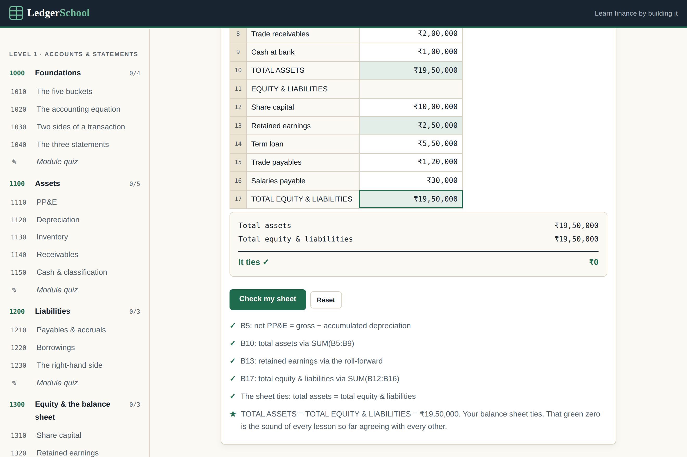

# FinStudio

**Learn finance by doing.** A free, text-only, W3Schools-style site that takes you from
"I know nothing about finance" to understanding, calculating, analysing and building
real financial models — by making you build every number yourself in a live in-browser
spreadsheet, with a balance sheet that has to tie.

No videos. No sign-up. No backend. No build step.



---

## What's in it

- **38 lessons across 9 modules** — foundations, assets, liabilities, equity and the
  balance sheet, the income statement, the cash flow statement, ratios, three-statement
  linking, and modelling & valuation
- **35 spreadsheet sandboxes**, 192 cells you fill in yourself
- **9 module quizzes**, five questions each, with an explanation for every option
- **A 74-term glossary** — plain English first, then the technical definition — that
  opens in place inside a lesson without navigating away
- **A reference section**: every statement line defined, plus a one-page formula sheet

### One company, all the way through

Every number belongs to **Bombay Bean Coffee Co.**, a Mumbai café, defined once in
`js/lessons/company.js`. The P&L capstone's profit after tax (₹1,80,000) is the exact
figure inside the balance sheet's retained earnings; the cash flow capstone's closing
cash (₹1,00,000) is that balance sheet's cash line; the sheet ties at ₹19,50,000.
`company.js` carries a `verify()` self-audit that proves it, and the test suite runs it.

### The spreadsheet behaves like Excel

Tab and Shift+Tab, Enter and Shift+Enter, F2 to edit, Delete to clear, Ctrl+C/X/V with
relative references shifting in both axes, Ctrl+D and Ctrl+R to fill, Ctrl+Z to undo.

And where the point of a lesson is the formula, typing the right *number* is rejected:

> ✗ B4 has the right value, but type it as a formula (start with =) — that's the point
> of the exercise.

---

## Deploying it

The site ships as a **single self-contained `index.html`** with all CSS and JavaScript
inlined. Upload it to the repository root and GitHub Pages serves it as-is —
no folders, no build, nothing to configure.

| File | Needed? | What it does |
|---|---|---|
| `index.html` | **required** | the entire site |
| `404.html` | recommended | on-brand page for bad URLs; also self-contained |
| `favicon.svg` | optional | browser-tab icon |
| `LICENSE` | recommended | the two-part licence below |
| `README.md` | optional | this file |

Then: **Settings → Pages → Deploy from a branch → `main` → `/ (root)`**.
Full steps and post-deploy checks are in [deploy.md](deploy.md).

### Working on the source

The single file is a *build artifact*. The editable source is the multi-file tree
(`css/`, `js/`, `js/lessons/`, `tests/`). To rebuild the single file after editing:

```bash
node build-single.cjs    # writes dist/index.html, dist/404.html, dist/favicon.svg
```

To run the source directly, open the multi-file `index.html` — `file://` works, or
`npx serve .` if you prefer.

> **Uploading folders through the GitHub web UI:** the drag-and-drop uploader flattens
> directories when you select files individually. Press `.` on the repository page to
> open **github.dev**, which preserves folder structure.

### Tests

Two zero-dependency test pages — open them in a browser, no runner, no install:

| File | Covers |
|---|---|
| `tests/engine.test.html` | 151 assertions: parsing, en-IN formats, operators, ranges, functions, cycle detection, checks, reference shifting |
| `tests/lessons.test.html` | 300 assertions: solves **every** sandbox with the intended formulas and requires all checks to pass, mutation-tests each cell, audits MCQs, quizzes, glossary and reference links |

The page title reads `PASS 300/300` or `FAIL`, so both can be driven headlessly in CI.

---

## Roadmap

See [FINSTUDIO_PLAN.md](FINSTUDIO_PLAN.md) for the full audit and delivery order.
Next up: reusable calculators, global search, and a startup-finance module.

## Author

Designed and developed by **Rohit Gorai**.

## Licence

Two parts, two licences — see [LICENSE](LICENSE) for the full text.

- **The software** (spreadsheet engine, router, renderers, design system, build config,
  tests) — **MIT**. Use it, fork it, build on it.
- **The course content** (every lesson, exercise, sandbox, quiz, glossary entry,
  reference page and the company dataset) — **© 2026 Rohit Gorai, all rights
  reserved.** Free to read and learn from, and please do link to it, but copying,
  republishing, adapting, using it in a competing course, or using it to train
  machine-learning models is not permitted without written permission.

*Educational content only — not investment, accounting or tax advice.*
